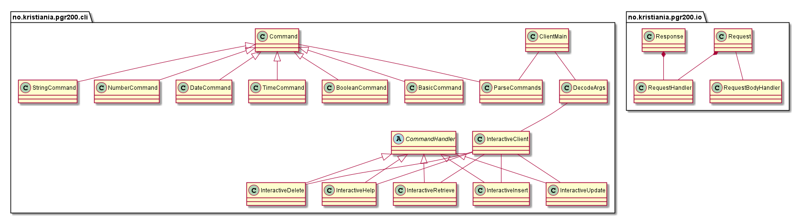
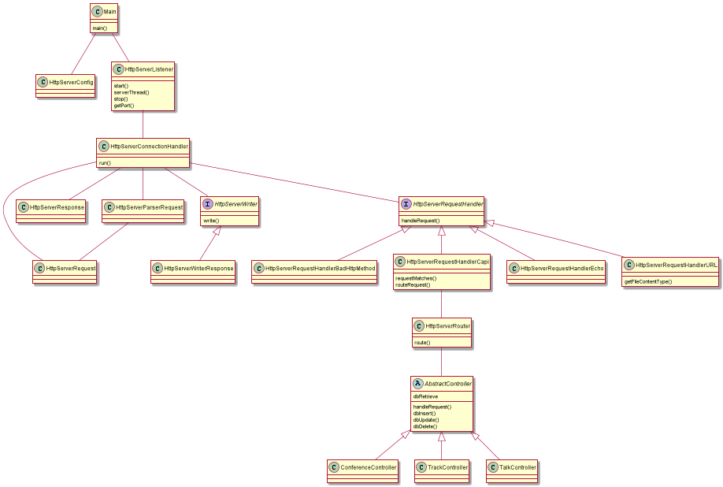
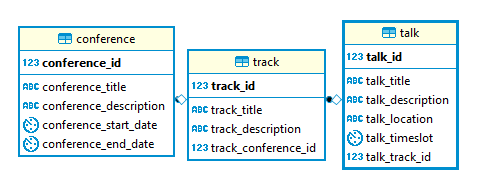
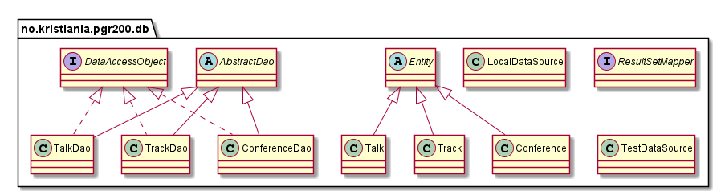

[](https://travis-ci.com/Westerdals/pgr200-eksamen-Alacho2)
# PGR200 Hovedinnlevering

#### Group
- Alexander Bredesen - breale17
- Håvard Nordlie Mathisen - mathav14
- Jason Nilsen - wiljas17

##### Links
-  - Ikke fått per 11.11.2018, 14:30
- 
- https://www.youtube.com/watch?v=KgCM49XvPJI&feature=youtu.be

# Start
Describe how to run the program

```bash
> mvn test
> mvn package

  !!! Remember to run the server so the client can connect to it !!!
    
 RUN THE SERVER
> java -jar server/target/[SERVER_JAR_FILE]
> java -jar server/target/[SERVER_JAR_FILE] RESET // rests the database (if you want)

 RUN THE CLIENT 
> java -jar client/target/[JAR_FILE] START // InteractiveClient
> java -jar client/target/[JAR_FILE] LIST [TABLE_NAME]  // Lists all the rows
> java -jar client/target/[JAR_FILE] LIST [TABLE_NAME] [ID]  // Lists one row

  -----------------------------------------------------------------

    THESE MODES WILL RUN THE MODE START AFTER THEY ARE EXCECUTED
    AND GO INTO THE INTERACTIVE MODE

> java -jar [JAR_FILE] UPDATE CLIENT [HOST_NAME] [PORT] // UPDATE CLIENT
> java -jar [JAR_FILE] UPDATE DATABASE [URL] [USERNAME] [PASSWORD] // UPDATE DATABASE
```

#### Cheat list :+1:
```
VÆR SIKKER PÅ AT SERVER KJØRER FØR DU KJØRER CLIENT!

Kommandoer vil altid bli skrevet med "-" først så vi kan se forskjell på for eksempel
ordet "i" vs kommandoen "-i"

Kjører du programmet i interactive mode (ved parameter START) så vil du bli spurt om input.
Første steg her blir å velge mode, dette kan for eksempel være:
* (-h) for hjelp
* (-t) for tables
* (-i) for insert
* (-r) for retrieve
* (-u) for update
* (-d) for delete

Velger du -i | -r | -u | -d vil du bli spurt om hvilket table du vil gjøre operasjonen på.
* CONFERENCES
* TRACKS
* TALKS

Når du har valgt table vil programmet spørre om input basert på hvilken mode og hvilket table.


VIKTIG!!
Skal du inserte noe i databasen så må du først inserte en conference deretter en track som har en
conference_track_id som matcher den conferencen som du ønsker og deretter kan du inserte en talk som
har en talk_track_id som matcher hvilke track.


Ekstra features
* (-e) for exit 
* (-b) for back -> fungerer ikke under kritiske operasjoner i programmet
```

## Extra functionality
##### Interactive client
Vi laget en klient som kan være interaktiv med brukeren og håndere ulike type input, vi har også
mye feilhåndtering som er viktig når en bruker kan gi sin input til programmet, i forhold til
testing av dette så simulerer vi bruker input og sjekker at dette blir håndtert på rett måte
i forhold til hvordan vi ønsker programmet skal kjøre.

##### Web server
The server also functions as a simple web server.  Connect to the server with your browser at localhost:port,
and it will load the default index.html and associated .css file.  If you add more resources to the local directory,
the server should server those as well.  The server still retains the original "echo" functionality
from the first innlevering as well, so /echo?body=hello+world or /echo?status=404 will still
work.

##### Generics
Vi bruker Generics i programmet på grunn av at det letter noe av mengde kode vi trenger for å utføre 
noen oppgaver, eksempler på generics er:

``` java
    public T getValue() {
        return value;
    }

    public Command setValue(T value) throws IllegalArgumentException {
        this.value = handleValue(value);
        return this;
    }
    
    protected <T> void updateOneById(String sql, T[] values) throws SQLException {
        PreparedStatement statement = makePreparedStatement(sql);
        for (int i = 0; i < values.length; i++) {
            statement.setObject(i + 1, values[i]);
        }
        statement.executeUpdate();
      }
``` 

##### Testing exceptions
Vi ønsker å teste at for eksempel noen av våres input blir korrekt håndtert og exceptions blir
kastet korrekt. Eksempler på kode vi har som tester dette er:

``` java
    @Test
    public void testHelpCommandThrowsIllegalArgumentException(){
        HelpCommand command = exampleHelpCommand();
        assertThatThrownBy(() -> {
            command.setValue(null);
            command.setValue("");
        }).isInstanceOf(IllegalArgumentException.class)
                .hasMessageContaining("Invalid Input");
    }
    
        @Test
        public void testInvalidDate(){
            String invalidDate = "40402005";
            assertThatThrownBy(() -> {
                LocalDate.parse(invalidDate, DateHandler.dateTimeFormatter);
            }).isInstanceOf(DateTimeParseException.class)
            .hasMessageContaining("");
        }
```


## Evaluation
Når vi startet på selve eksamensoppgaven så hadde vi flere forskjellige deler som måtte settes
sammen, både client, database og server. Siden vi visste at den koden vi skrev da skulle passe sammen
under eksamensinnleveringen så hadde vi laget delene enkle å endre, så vi kunne bare sette de sammen 
bare ved å gjøre noen små konfigurasjoner. 

#### Cooperation
Vi støtte på noen feil også i prosessen ved for eksempel hvordan http path og body egentlig skulle parses, vi hadde i starten noen ulike 
syn rundt dette, men vi kom fram til en felles enighet/standar. 

Andre problemer vi også har møtt på har vi løst og har vi hatt problemer med å løse noe så har vi alltid
kunne spurt andre på gruppa. Siden vi har jobbet my i felles på skolen og hatt mye kontakt via kommunikasjonskilder
så har vi kunne jobbet som en veldig god og fungerende gruppe som har både tilegnet og lært bort mye til hverandre.

Andre ting vi som gruppe har blit flinkere på under denne eksamenen er dette med å forstå kode andre skriver og kunne komme
med innspill på hvordan man kan gjøre kode bedre og hvordan det å parprogrammere kan bedre kvaliteten på koden.

## Conclusion Eval

#### Alexander Eval
Jeg er veldig fornøyd med hvordan vi har jobbet som en gruppe og hvordan vi har klart
å løse denne store oppgaven. Vi har alltid kunne spurt hverandre om hjelp og lært hverandre
nye ting gjennom hele prosjektet. Vi har endt opp med et klient-server-database program som
jeg mener har blitt gjort på en god måte og vi har lagt ned mye tid som har gitt oss mulighet
til å gå inn i pensum og laget mange gode funksjoner til programmet og jeg mener vi også
har gått lengre enn pensum og levert et kompleks og godt program. På grunn av alle dise 
faktorene så mener jeg at vi fortjener en A på denne innleveringen.

#### Jason Eval
I enjoyed the project a great deal, and learned enormously from it.  Http servers are more
complicated than they look.  With this project, I have finally broken the my bad habit of
writing tests after I write code, rather than before.  Also, this is the first time I've 
used unit testing on such a large project, and it has saved us on many occasions.  Being able
to instantly see when new code breaks old functionality is invaluable.  There are parts of 
this application that I feel would have been much easier if I understood generics, reflection,
and annotations better, so I'll definitely be focusing on those in the future.

I'm not fond of the "what grade do you think you deserve" idea, but I'll give it a shot. I 
think this project deserves a solid A.  We went far above the assignment, and adding a ton of 
additional functionality.  Instead of just taking command line args, we built an entire interactive
terminal client.  Instead of just parsing api requests, the server also works as a full web server
capable of serving html and css.  We have 80%+ coverage on unit testing, and we've built at least
a primitive RESTful api.

#### Håvard Eval
I det store og hele føler jeg vi har jobbet godt med denne eksamen. Vi startet veldig tidlig med 
prosjektet og har hele veien jobbet godt med det. Alle tre har vært en god påvirkelig kilde til
hverandres kode og lært hverandre masse nytt. Både av programmeringsferdigheter verktøy til programmering.
I tillegg har vi gått langt over det original designet til hva programmet skal kunne med webserver, 
sending av json objekter mellom clienten og serveren, generics i databasen og generelt det overordende
er en god implementasjon av oppgaven.

Når det kommer til karakter, så vil jeg ikke si noe annet enn at jeg er enig i det to andre sier. Skulle 
jeg tvunget meg selv til det, ville jeg sagt A.

## Diagrams
### Client 

### Server 

### Database
##### Entity

##### Class



## Oppgave

Innleveringsfrist: 12. november kl 09:00. **Viktig:** WiseFlow *stenger* når fristen er ute - lever i tide.

Tag koden med `innlevering` i GitHub og last opp en ZIP-fil til WiseFlow. Dersom du ikke fikk godkjent innlevering #1 eller #2 i første runde, last opp zip-fil av disse i tillegg.


Du har funnet en konferanse du er interessert i å gå på, men du har ikke råd til billetten. Men frykt ikke: etter at du tok kontakt med de som organiserer konferansen fikk du høre at du kunne få gratisbillett dersom du hjelper til å lage noe programvare for konferansen.

Oppgaven din: lag en server for appen som inneholder konferanseprogrammet i en database. Funksjonaliteten må som et minimum tillate at man legger inn og lister ut foredrag på konferansen. Du bruke datamodellen angitt under eller forenkle eller endre den slik du selv ønsker.

Programmet skal følge god programmeringsskikk: Det skal ha enhetstester, det skal ha en god README-dokumentasjon, det skal hente inn konfigurasjon fra en .properties-fil. Fila skal ligge i current working directory, hete `innlevering.properties` og inneholde properties `dataSource.url`, `dataSource.username` og `dataSource.password`. Når vi evaluerer oppgaven ønsker vi å bruke egne verdier for disse. Prosjektet bør også bygge automatisk på [Travis CI](https://travis-ci.com).

Pass på at det er godt med tester, at koden kompilerer og kjører ok med "mvn test" og at du beskriver hvordan man tester løsningen manuelt.

Eksempel kjøring (inkluder dette i README.md-fila deres):

```bash
> mvn test
[INFO] Scanning for projects...
[INFO] ------------------------------------------------------------------------
[INFO] Building conference-server 0.1-SNAPSHOT
[INFO] ------------------------------------------------------------------------
[INFO]
[INFO] --- maven-compiler-plugin:3.1:compile (default-compile) @ conference-server ---
[INFO] Compiling 25 source files to e:\Profiles\jbrodwal\workspaces\demo\conference-server\target\classes
[INFO]
[INFO] --- maven-compiler-plugin:3.1:testCompile (default-testCompile) @ conference-server ---
[INFO] Changes detected - recompiling the module!
[INFO] Compiling 9 source files to e:\Profiles\jbrodwal\workspaces\demo\conference-server\target\test-classes
[INFO]
[INFO] --- maven-surefire-plugin:2.12.4:test (default-test) @ conference-server ---

-------------------------------------------------------
 T E S T S
-------------------------------------------------------
....
> mvn install
[INFO] Scanning for projects...
[INFO] ------------------------------------------------------------------------
[INFO] Building conference-server 0.1-SNAPSHOT
[INFO] ------------------------------------------------------------------------
[INFO]
...
[INFO] --- maven-jar-plugin:2.4:jar (default-jar) @ conference-server ---
[INFO] Building jar: e:\Profiles\jbrodwal\workspaces\demo\conference-server\target/conference-server-0.1-SNAPSHOT.jar
[INFO]
[INFO] --- maven-shade-plugin:3.1.1:shade (default) @ conference-server ---
[INFO] Including org.postgresql:postgresql:jar:42.2.2 in the shaded jar.
[INFO] Replacing original artifact with shaded artifact.
[INFO] ------------------------------------------------------------------------
[INFO] BUILD SUCCESS
[INFO] ------------------------------------------------------------------------
[INFO] Total time: 12.565 s
[INFO] Finished at: 2018-07-08T17:18:12+02:00
[INFO] Final Memory: 21M/211M
[INFO] ------------------------------------------------------------------------
> psql --username postgres --command="create database ... with owner .."'
> Oppdater innlevering.properties med dataSource.url, dataSource.username, dataSource.password
> java -jar target/database-innlevering.jar resetdb
> java -jar target/database-innlevering.jar insert "Mitt foredrag"
> java -jar target/database-innlevering.jar list
```

Som en del av semesterarbeidet skal dere levere en video på 3-8 minutter. Dersom dere har laget dette i forbindelse med innlevering #1 eller innlevering #2 kan dere bare legge ved denne video. I motsatt fall skal dere ta opp en video for mappeinnleveringen på 3-8 minutter der dere parprogrammerer. Velg gjerne en bit med kode som dere refactorerer. Screencast-o-matic anbefales som verktøy for video-opptaket, men andre verktøy kan benyttes. En lenke til videoen skal leveres og ikke videoen selv. Husk å åpne for tilgang til videoen ("unlisted" i Youtube) og legge inn lenke fra README.

Dere skal også gi tilbakemelding på en annen gruppes besvarelse. Tilbakemeldingen skal skrives i en egen fil (tilsvarende format som en README-fil) og inkluderes både i deres prosjekt og den andre gruppens prosjekt. Tilbakemeldingen dere har mottatt skal ligge i en fil som heter `MOTTATT-TILBAKEMELDING.md` og tilbakemeldingen dere har gitt skal hete `GITT-TILBAKEMELDING.md`.

I tilbakemeldingen er det lurt å stille spørsmålene: 1. Hva lærte jeg av denne koden? 2. Hva forsto jeg ikke av denne koden? 3. Hva tror jeg forfatterne av koden kunne ha nyttig av å lære?

## Sjekkliste for innleveringen

- [x] Kodekvalitet
  - [x] Koden er klonet fra GitHub classrom
  - [x] Produserer `mvn package` en executable jar? (tips: Bruk `maven-shade-plugin`)
  - [x] Bruker koden Java 8 og UTF-8
  - [x] Bygger prosjektet på [https://travis-ci.com](https://travis-ci.com)?
  - [x] Har du god test-dekning? (tips: Sett opp jacoco-maven-plugin til å kreve at minst 65% av linjene har testdekning)
  - [x] Er koden delt inn i flere Maven `<modules>`?
  - [x] Bruker kommunikasjon mellom klient og server HTTP korrekt?
  - [x] Kobler serveren seg opp mot PostgreSQL ved hjelp av konfigurasjon i fila `innlevering.properties` i *current working directory* med `dataSource.url`, `dataSource.username`, `dataSource.password`?
- [x] Funksjonalitet
  - [x] add: Legg til et foredrag i databasen med title, description og topic (valgfritt)
  - [x] list: List opp alle foredrag i basen med et valgfritt topic
  - [x] show: Vis detaljer for et foredrag
  - [x] update: Endre title, description eller topic for et foredrag
  - [ ] Valgfri tillegg: Kommandoer for å sette opp hvor mange dager og timer konferansen skal vare og hvor mange parallelle spor den skal inneholde.
- [x] Dokumentasjon i form av README.md
  - [x] Navn og Feide-ID på dere de som var på teamet
  - [x] Inkluderer dokumentasjonen hvordan man tester ut funksjonaliteten programmet manuelt? (Inkludert eventuell ekstra funksjonalitet dere har tatt med)
  - [x] Inkluderer dokumentasjonen en evaluering av hvordan man jobbet sammen?
  - [x] Inkluderer dokumentasjonen en screencast av en parprogrammeringsesjon?
  - [x] Inkluderer dokumentasjonen en evaluering *fra* en annen gruppe og en evaluering *til* en annen gruppe?
  - [x] Inkluderer dokumentasjonen en UML diagram med datamodellen?
  - [x] Inkluderer dokumentasjonen en link til screencast av programmeringsesjon?
  - [x] Inkluderer dokumentasjonen en egenevaluering med hvilken karakter gruppen mener de fortjener?

### Forberedelse

- [x] Finn endelig grupperpartner innen 1. november
- [x] Finn en gruppe for gjensidig evaluering innen 1. november

### Innlevering

- [x] Gi veilederne `hakonschutt` og `mudasar187` tilgang til repository
- [x] Tag koden med `innlevering` i GitHub
- [x] Ta en zip-eksport fra GitHub
- [x] Last opp zip-fil i WiseFlow
- [ ] Dersom innlevering #1 eller innlevering #2 ikke ble godkjent *i WiseFlow*, last opp zip-fil med hver av disse innleveringene